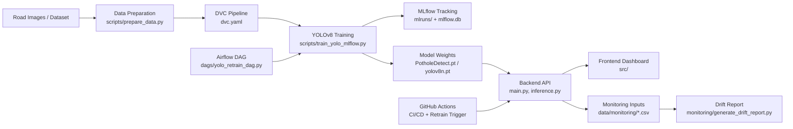
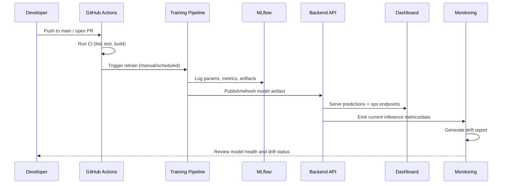

# RoadGuard AI Dashboard (MLOps)

Production-oriented MLOps project for road damage detection using YOLOv8, with experiment tracking, data versioning, monitoring, CI/CD automation, and an operational dashboard.

## Table Of Contents

- [Overview](#overview)
- [Architecture](#architecture)
- [Workflow](#workflow)
- [Tech Stack](#tech-stack)
- [Repository Structure](#repository-structure)
- [Getting Started](#getting-started)
- [Model Training And Tracking](#model-training-and-tracking)
- [Monitoring](#monitoring)
- [CI/CD And Automation](#cicd-and-automation)
- [API Quick Check](#api-quick-check)

## Overview

This repository combines:

- Frontend dashboard (Vite + React + TypeScript)
- Backend inference/API service (Python)
- YOLOv8 training pipeline with MLflow tracking
- DVC-enabled reproducible data workflow
- Monitoring and drift reporting
- Containerized deployment (Docker + Compose)
- Automated CI/CD and scheduled MLOps jobs (GitHub Actions + Airflow DAG support)

## Architecture



## Workflow



## Tech Stack

- Frontend: React, TypeScript, Vite
- Backend: Python, FastAPI-style API pattern (project-level Python API service)
- Computer Vision: Ultralytics YOLOv8
- Experiment Tracking: MLflow
- Data Versioning: DVC
- Orchestration: Apache Airflow DAG
- Monitoring: Evidently-based drift reporting workflow
- DevOps: Docker, Docker Compose, GitHub Actions

## Repository Structure

```text
src/                    Frontend app and UI components
main.py                 Backend API entry
inference.py            Inference logic
scripts/                Data prep and training scripts
monitoring/             Drift report generation
dags/                   Airflow retraining DAG
data/                   Raw/processed/monitoring datasets
dataset/                YOLO image/label dataset
mlruns/                 MLflow experiment artifacts
dvc.yaml                DVC pipeline definition
docker-compose.yml      Local multi-service orchestration
Dockerfile*             Frontend/backend container images
```

## Getting Started

### 1. Prerequisites

- Node.js 18+
- Python 3.10+
- Docker Desktop (optional but recommended)

### 2. Frontend Setup

```bash
npm install
npm run dev
```

### 3. Backend Setup

```bash
pip install -r requirements-backend.txt
python main.py
```

### 4. Full Stack With Docker Compose

```bash
docker compose up --build
```

Frontend: `http://localhost:3000`  
Backend health: `http://localhost:8000/api/v1/mlops/health`

## Model Training And Tracking

Install MLOps dependencies and train with MLflow tracking:

```bash
pip install -r requirements-mlops.txt
python scripts/train_yolo_mlflow.py --data data.yaml --model yolov8n.pt --epochs 50 --imgsz 640
```

Run MLflow UI:

```bash
mlflow server --backend-store-uri sqlite:///mlflow.db --default-artifact-root ./mlruns --host 127.0.0.1 --port 5000
```

## Monitoring

Generate a drift report from reference vs current datasets:

```bash
python monitoring/generate_drift_report.py --reference data/monitoring/reference.csv --current data/monitoring/current.csv --output reports/data_drift_report.html
```

## CI/CD And Automation

Implemented workflows include:

- CI: lint, build, and tests on PR/push
- CD: build and deploy pipeline on main
- Scheduled/manual retrain trigger with token-based API call

Recommended GitHub repository secrets:

- `DEPLOY_WEBHOOK_URL`
- `BACKEND_BASE_URL`
- `MLOPS_API_TOKEN`

## API Quick Check

```bash
curl http://localhost:8000/api/v1/mlops/health
```

## License

Add your preferred license (MIT/Apache-2.0/proprietary) before production distribution.
